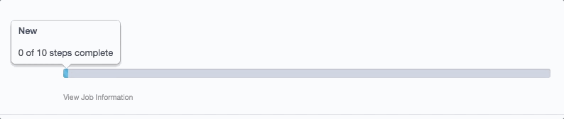
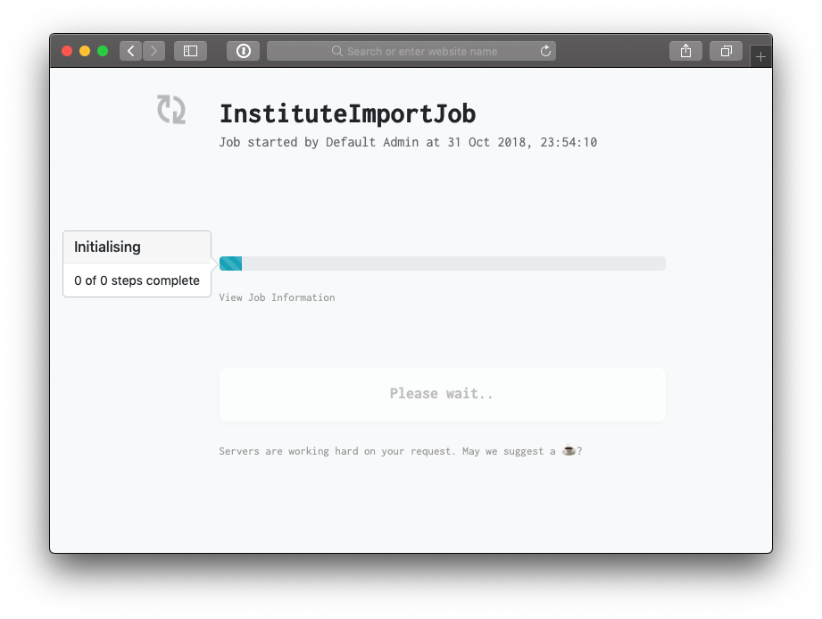

# SilverStripe QueuedJob Progress Field

A progress bar and screen for monitoring a [Scheduled Job](https://github.com/symbiote/silverstripe-queuedjobs).

[](https://travis-ci.org/fullscreeninteractive/silverstripe-queuedjob-progressfield)
[](https://packagist.org/packages/fullscreeninteractive/silverstripe-queuedjob-progressfield)
[](LICENCE)



## Installation

```
composer require fullscreeninteractive/silverstripe-queuedjob-progressfield
```

## Usage

The QueuedJobProgressField can be included in any `Form`

```php
use FullscreenInteractive\QueuedJobProgressField\QueuedJobProgressField;

$fields = [
    // ...
    QueuedJobProgressField::create('ScheduledJob', '', $this->ScheduledJobID)
];

This module also provides a `Controller` subclass which displays the state of
the job if needed. Setup a route to point to the `QueuedJobProgressController`

```
Director:
  rules:
    'upload//$Action/$ID': 'FullscreenInteractive\QueuedJobProgressField\QueuedJobProgressController'
```

Then you can redirect users to `site.com/upload/progress/<jobSignature>/<jobId>`
to see the live progress of the job.



